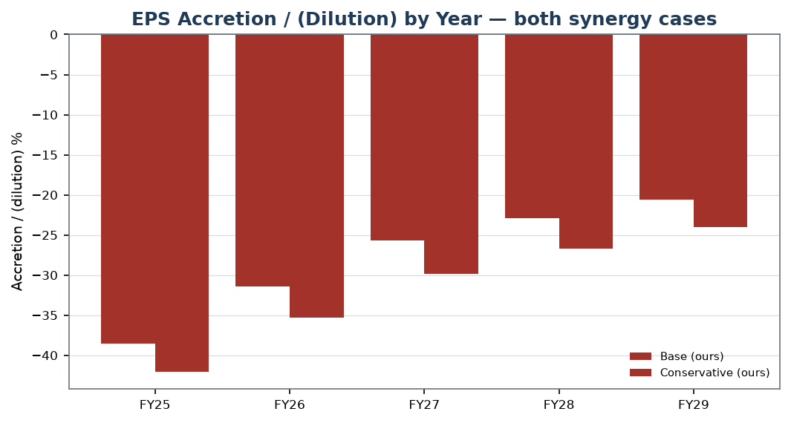
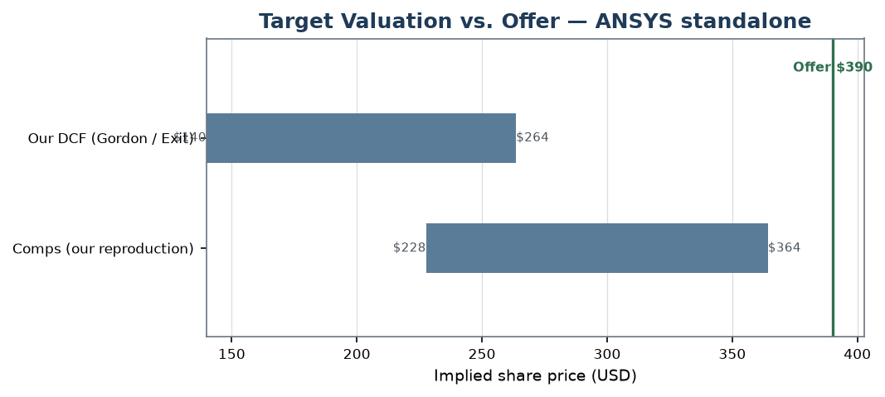

# proforma

[](https://github.com/billdmar/proforma/actions/workflows/ci.yml)
[](LICENSE)
[](pyproject.toml)

📄 [Read the memo (PDF)](releases/SNPS_ANSS_deal_memo.pdf) ·
📊 [Download the model (Excel)](releases/SNPS_ANSS_merger_model.xlsx) ·
🧾 [Assumptions ledger](docs/ASSUMPTIONS.md) ·
🎤 [Interview notes](docs/INTERVIEW_NOTES.md)

**A full merger model built on a real announced deal — Synopsys's ~$35B
acquisition of ANSYS — reconstructed from the actual SEC filings into a
live-formula Excel model and an M&A committee memo, then differentially verified
against the deal's own disclosed fairness opinion.** Every number is computed by
a Python engine; the workbook expresses it as live formulas; the memo renders
it; and a verification suite proves the three agree to the cent.

> _Educational reconstruction from public SEC filings. Not investment advice.
> Synergy figures are labeled assumptions, not forecasts. No verdict is passed
> on whether the transaction should occur; no endorsement by the SEC, the named
> companies, or their financial advisors is implied._

---

## Headline — Synopsys (SNPS) / ANSYS (ANSS)

| | |
|---|---|
| **Consideration** | **$197.00 cash + 0.3450 SNPS share** per ANSYS share |
| **Implied value / premium** | **$390.19 / share** · **28.7% premium** (Dec-21-2023 unaffected) |
| **Equity purchase price** | **~$34.1B** (30.1M new SNPS shares; target holders own ~16%) |
| **Financing** | $10.0B senior notes + $4.3B term loan + ~$3.0B cash (disclosed structure) |
| **Goodwill (our PPA)** | **$22.6B** on an $8.0B intangible step-up _(vs. ~$26.9B actually recorded)_ |
| **Accretion/(dilution), base case** | **−38.5% / −31.4% / −25.6%** (Yr 1–3) — GAAP-dilutive, cash-EPS far less so |
| **Breakeven synergies (Yr-1 A/D = 0)** | **~$1.25B/yr** — well above our $150M–$300M cases |
| **Standalone ANSYS DCF (ours)** | **~$140 (Gordon) / ~$264 (exit)** vs. the $390 offer → premium is for control/strategy |
| **Fairness reproduction (mean overlap)** | **67.3%** vs. Qatalyst's disclosed ranges (DCF 46% · comps 79% · precedents 77%) |

_Every figure above is engine-computed and machine-verified (below); synergy
cases and the standalone DCF are **our** labeled assumptions (see
[ASSUMPTIONS.md](docs/ASSUMPTIONS.md)), the consideration/premium/financing are
disclosed facts with SEC provenance._

<p align="center">
  
  
</p>
<sub>Left: pro forma EPS accretion/(dilution) by year, both synergy cases. Right:
standalone ANSYS valuation (our DCF / reproduced comps / precedents) vs. the
offered $390.19.</sub>

## Deliverables
- **`releases/SNPS_ANSS_merger_model.xlsx`** — 13-tab live-formula merger model:
  Cover · Assumptions (blue inputs) · Acquirer · Target · Deal & S&U · PPA ·
  Pro Forma IS · Pro Forma BS · Accretion-Dilution · Contribution ·
  Sensitivities · Precedents · Fairness Comparison.
- **`releases/SNPS_ANSS_deal_memo.pdf`** — a 9-section M&A committee memo: deal
  overview, strategic rationale, target valuation, structure & financing,
  purchase price accounting, accretion/dilution, synergies, risks, and the
  fairness-opinion comparison appendix.
- **`src/`** — the Python engine (EDGAR extraction → dual standalone models →
  deal engine → combination engine → workbook + memo + verification).

## Verification — the moat
Every number is engine-computed and machine-checked in CI (committed SEC
fixtures only; live EDGAR is never called in CI):
- **Dual-company XBRL tie-out** — **1,728** historical statement lines (SNPS 907
  / ANSS 821) reconcile to SEC-reported facts **to the dollar** (tol = $0.00).
- **Excel ↔ Python differential** — the workbook is recalculated (via the
  `formulas` library) and **61 computed formula cells match the engine to the
  cent**, including the sensitivity and fairness tabs.
- **Deal invariants** — sources = uses; goodwill ties the purchase-price walk;
  the pro forma balance sheet balances every period; the EPS bridge and
  accretion/dilution recompute independently; contribution ties to ownership;
  synergy phase-in sums.
- **Fairness differential** — Qatalyst's **disclosed** assumptions, run through
  our engine, reproduce their disclosed implied per-share ranges (mean overlap
  67.3%); deviations are explained in writing, never tuned away.
- **Report-number lint** — every figure in every memo exhibit table traces to an
  engine value; a fabricated table number fails the build.
- **Sensitivity sanity** — premium ↑ ⇒ more dilutive, synergies ↑ ⇒ more
  accretive (monotone), breakeven consistent with the grids.
- **Determinism** — a full rebuild from cached data reproduces identical numbers
  and a byte-identical workbook.
- **≥90% coverage, gated in CI** — **97.7%** line coverage across **260 tests**,
  green on committed fixtures.

## Architecture
```
SEC EDGAR (XBRL CompanyFacts + DEFM14A/S-4/8-K text)
  └─ src/edgar      NormalizedFacts (both companies) + DealTerms + FairnessDisclosure (provenance-stamped)
       │
  src/standalone    driver-based 3-statement models (revolver plug, fixed-point interest, balances by construction)
       │
  src/deal          consideration · sources & uses · purchase price accounting → goodwill
       │
  src/combine       pro forma IS/BS · EPS bridge · accretion/dilution · contribution
       ├─ src/valuation, src/comps   standalone ANSYS DCF + reproduced comps
       ├─ src/scenarios              premium×synergies / mix grids + breakeven
       ├─ src/fairness               reproduce Qatalyst's disclosed ranges → overlap
       │
  src/flagship  →   one MergerModelBundle (single source of truth)
       ├─ src/workbook   live-formula .xlsx
       ├─ src/report     WeasyPrint memo PDF + matplotlib charts
       └─ src/verify     tie-out · Excel↔Python differential · invariants · report-lint · determinism
```

## Quickstart
```bash
python3.12 -m venv .venv
.venv/bin/python -m pip install -e ".[dev]"

# run the full verification suite (offline, committed fixtures)
PROFORMA_OFFLINE=1 .venv/bin/python -m pytest -m "not live" --cov=src

# rebuild the workbook + memo deterministically into out/ and releases/
PROFORMA_OFFLINE=1 .venv/bin/python scripts/build_deliverables.py
```
macOS needs the WeasyPrint native libs (`brew install pango cairo gdk-pixbuf
libffi`); see [docs/ENV.md](docs/ENV.md). Architecture in
[docs/DESIGN.md](docs/DESIGN.md); every assumption is argued in
[docs/ASSUMPTIONS.md](docs/ASSUMPTIONS.md).

## Data & disclaimer
All data is from SEC EDGAR under its fair-access policy; committed fixtures are
public-domain filings. This is an educational reconstruction — not investment
advice, and not affiliated with or endorsed by Synopsys, ANSYS, their advisors,
or the SEC.

## License
MIT — see [LICENSE](LICENSE).
